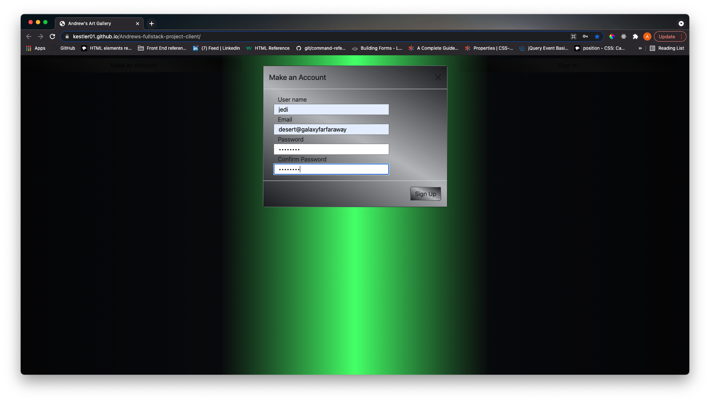
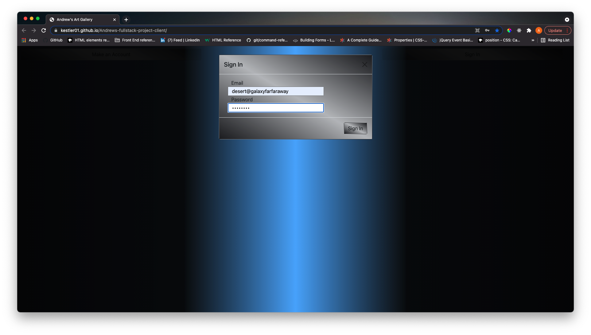
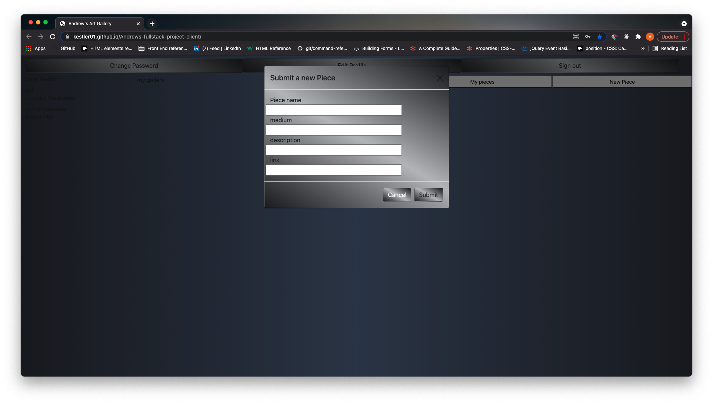
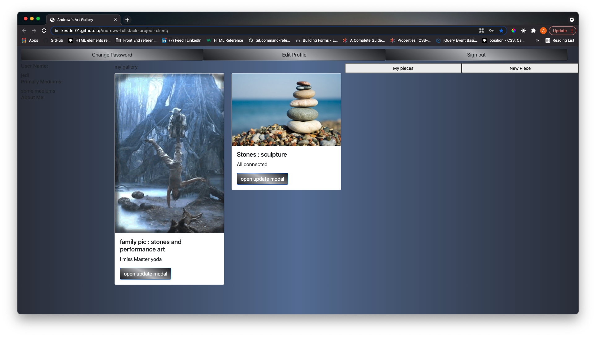

### ScreenShots of deployed app

### Andrew's Art Blog:
I wrote this application as a project for the General Assembly Software Engineering Immersive in Aug of 2021. The Objective is to develope a fullstack application to demonstrate how to use our class lessons and bring them together to create a SPA.
This Art gallery app demonstrates a strong understanding of these idea's by allowing a user to create and edit art pieces which they upload after signing up, establishing a 1 to many relationship. These pieces are not visible to other users via authenticated routes and you must be signed in to use the app. 
A stretch goal, which currently is unfinished is to add another 'show' resource, which a user could create, and add pieces to, and then share, edit and delete. With the implementation of 'show's the home view would require added functionality to be populated by other user's shared shows, which would complete the initial vision. 

### Technology Used:
- Express
- MongoDb
- Mongoose
- Passport
- JavaScript
- JQuery
- HTML/CSS
- Bootstrap

### Links:
- my backend github repository (https://github.com/kestler01/Andrews-fullstack-project)
- my frontend github repository (https://github.com/kestler01/Andrews-fullstack-project-client)
- my deployed application (https://kestler01.github.io/Andrews-fullstack-project-client/)

### Entity relationship diagram:

